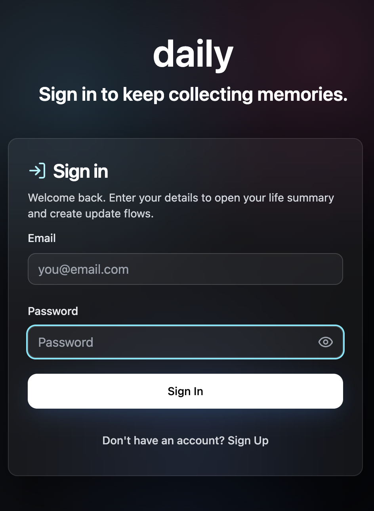
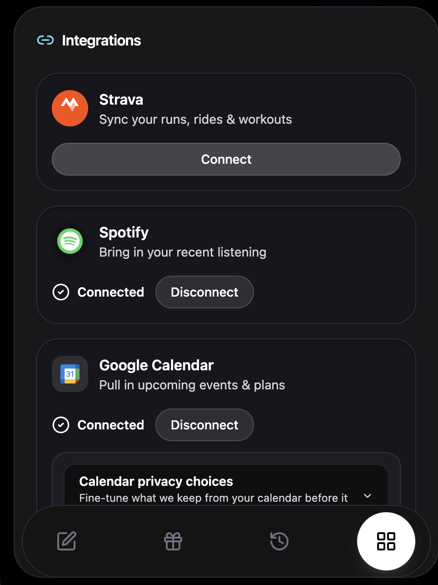
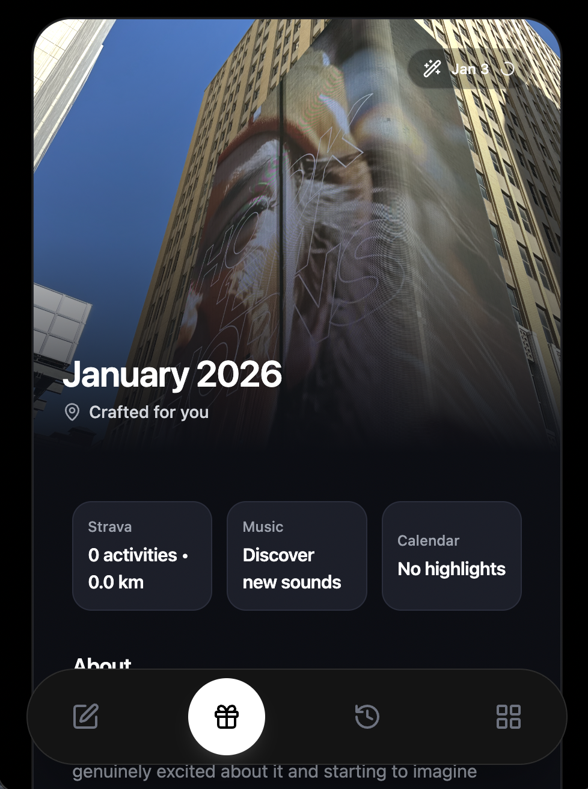
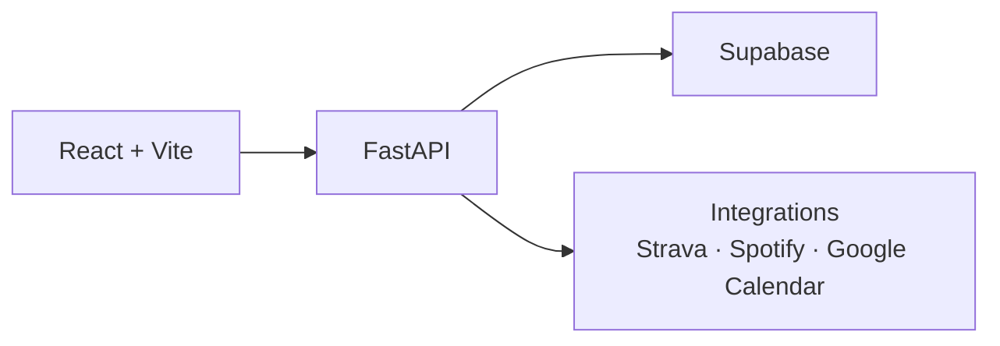

# d-AI-ly

dAIly is a private, AI-powered life recap app that helps you understand and remember your life with minimal effort. It quietly collects the moments you already create like reflections, workouts, music, and events, and turns them into thoughtful monthly summaries that capture not just what happened, but what it meant.

What dAIly Does

Collects life updates (text + photos)

Connects to Strava, Spotify, and Google Calendar

Generates AI-written monthly recaps (“Wraps”)

Highlights themes, patterns, and key moments

Stores everything privately for long-term reflection

Works as a Progressive Web App (PWA) on desktop and mobile

🧠 Core Idea

“dAIly collects your memories for you, so you can easily recap them.”

Instead of asking you to document everything, dAIly uses the signals you already generate to build a coherent narrative of your life over time.

## Stack
- Frontend: Vite, React, TypeScript, Tailwind, shadcn-ui
- Backend: Python, FastAPI (uvicorn), Strava + Supabase integrations
- Misc: Supabase auth/storage/DB, Vite dev server

## Screenshots
Login flow:


Connect integrations:


Generate wrap:


## Architecture


## Getting started
Prereqs: Node.js, npm, Python 3.10+, and Supabase env vars configured.

```sh
# Clone and install
git clone https://github.com/arjuns238/ai-friend-flow.git
cd ai-friend-flow
npm install

# Create env files
cp .env.example .env
cp python-backend/.env.example python-backend/.env

# (Optional) create a Python venv
python -m venv .venv
source .venv/bin/activate
pip install -r python-backend/requirements.txt

# Run the backend (from python-backend/)
cd python-backend
uvicorn main:app --reload --port 8000

# In another terminal, run the frontend (from repo root)
cd ..
npm run dev
```

## Progressive Web App

The Vite frontend now ships with [`vite-plugin-pwa`](https://vite-pwa-org.netlify.app/):

1. During development run `npm run dev` as usual — the plugin's development service worker is automatically enabled so you can test install/offline flows locally.
2. For a production-like test, run `npm run build && npm run preview` and open the preview URL in Chrome or Edge. Use the browser's "Install App" button (or the Application tab in DevTools) to install.
3. When new builds ship, the service worker updates itself (`registerType: autoUpdate`). Users see the fresh content on the next navigation; check the console logs for refresh/offline-ready messages while developing.

Front-end is hosted on https://automated-life-updates.pages.dev/

Back-end is hosted on render on the URL - https://automated-life-updates.onrender.com
